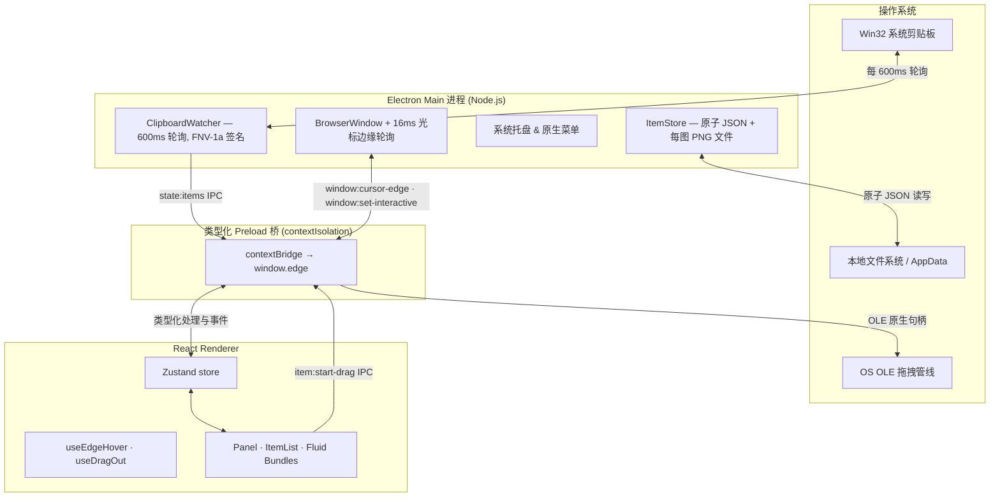
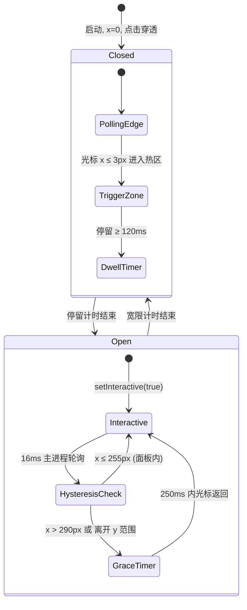
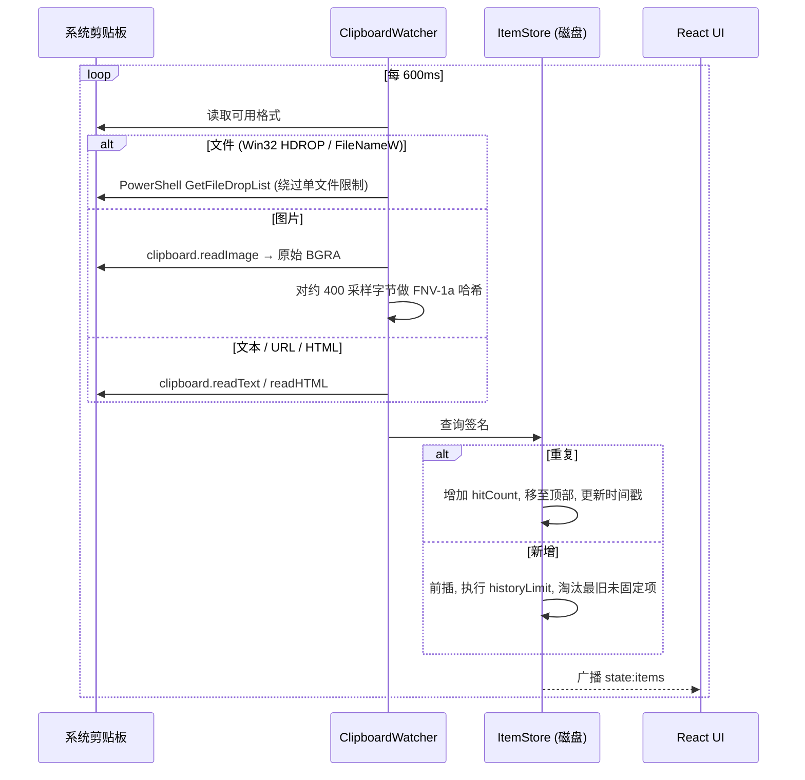
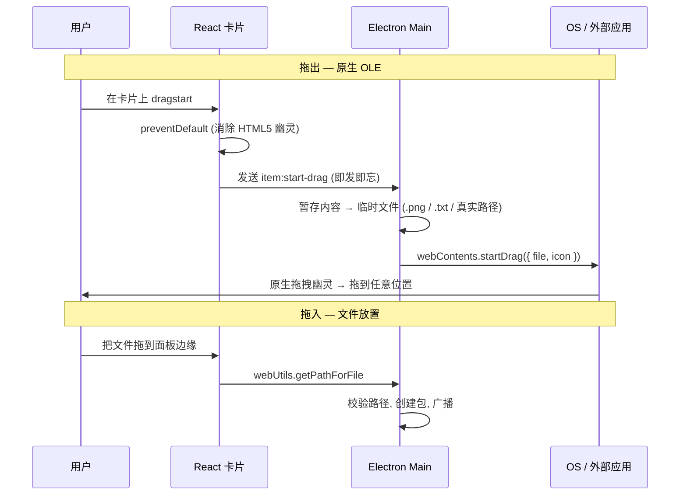

<p align="center">
  
</p>

<h1 align="center">Edge-Drop</h1>

<p align="center">
  <strong>一个零点击、悬停即激活的剪贴板侧边栏，桌面端原生 OS 文件传输枢纽。</strong><br/>
  隐身驻留在屏幕边缘。鼠标靠近即展开，把任何东西拖出去——拖进 Photoshop、Word、Slack、资源管理器，任何地方。
</p>

<p align="center">
  <a href="#快速开始">快速开始</a> ·
  <a href="#演示">演示</a> ·
  <a href="#工作原理">工作原理</a> ·
  <a href="#架构">架构</a> ·
  <a href="#安全">安全</a> ·
  <a href="#本 fork 的改动">本 Fork 的改动</a> ·
  <a href="#路线图">路线图</a> ·
  <a href="#贡献">贡献</a>
</p>

<p align="center">
  <sub>基于 Electron · React · TypeScript · Framer Motion · Zustand 构建</sub><br/>
  <sub>许可证：Apache-2.0 &nbsp;·&nbsp; 状态：公开测试版</sub>
</p>

---

## 关于本 Fork

本仓库 fork 自原项目 [Deepender25/Edge-Drop](https://github.com/Deepender25/Edge-Drop.git)，在原版基础上做了以下改动：

### 1. 中文汉化
将所有面向用户的文案翻译为简体中文，包括：
- 设置页全部选项（重启清除、自动删除、历史容量、边缘触发、面板高度、无痕模式、开机自启等）
- 新手引导（Onboarding）7 页流程与快捷提示
- 托盘菜单、首次启动通知
- 卡片操作 tooltip（固定 / 复制 / 删除 / 拆分 / 复制文件路径等）
- 类型标签（文本 / 图片 / 链接 / 文件 / 压缩包 / 代码 等）
- 相对时间（刚刚、3 分钟前、2 小时前…）
- 合并 / 拆分 Toast 提示与失败原因
- `index.html` 的 `lang` 改为 `zh-CN`

> 保留英文的部分：产品名 Edge-Drop、通用文件类型名（PDF / Word / Excel）、系统快捷键（Alt+C / Ctrl+C）。

### 2. 多屏适配（第一阶段）
原版面板固定贴在主屏左缘，双屏时在屏幕接缝处会触发错位。本 fork 新增「显示位置」设置：
- 在设置页可选择面板贴靠的**显示器**与**外边缘**（左 / 右）
- **自动排除屏幕接缝**——双屏左右排列时，左屏右缘、右屏左缘不会出现在选项里，避免接缝误触
- 窗口几何与光标边缘检测统一基于所选显示器，修改设置后立即重定位
- 支持右边缘锚定（面板圆角、flare 装饰、拆分堆叠发光条均已镜像适配）

> 路线图中的「Multi-monitor support」对应本项。第二阶段（上 / 下边缘 + 横向面板布局）尚未实现。

### 3. 字体清晰度修复
针对 Electron 透明窗口在 Windows 显示缩放下文字发糊的问题：
- 启动参数加入 `force-device-scale-factor=1` 与 `high-dpi-support`
- 面板打开静止态 `filter` 由 `blur(0px)` 改为 `none`，避免静止态被强制留在 1x 光栅化合成层

### 4. 局域网传到手机
在剪贴板侧边栏上增加扫码传文件能力（无需手机 App）：
- 单条：卡片菜单「发送到手机」→ 二维码 → 手机浏览器下载
- 批量：暂存箱攒文件后统一生成二维码；支持拖入、放入当前剪贴板
- 本机 HTTP 服务（默认端口 7331 起探测），同一 Wi-Fi 即可访问

---

## 为什么做这个

市面上的剪贴板管理器都在打断你的流程：复制、切应用、粘贴，然后用方向键在 `Win+V` 历史里翻找，或钻进托盘菜单。多步、模态、慢。

**Edge-Drop 消除了这些摩擦。** 它以透明、置顶、点击穿透的形式锚定在显示器边缘像素上。光标靠近边缘，侧边栏即弹出。把图片、文件堆、富文本、HTML 包从里面*拖出去*——直接拖进你正在用的任何桌面应用。无需快捷键、无需切窗口、无需模态对话框。

它为开发者和创意工作流而生：你总要在多个窗口间频繁切换截图、代码片段、文件路径、设计素材和参考链接。

---

## 演示

> 所有演示均为静音自动循环。悬停可拖动进度条，右键 → 在新标签页打开查看原图。

<table>
  <tr>
    <td width="50%" align="center"><b>1. 欢迎使用 Edge-Drop</b><br/><br/>
      <video src="https://github.com/user-attachments/assets/118d59cc-9821-4da1-9424-ea9bc1b6e548" width="100%" autoplay loop muted playsinline></video>
    </td>
    <td width="50%" align="center"><b>2. 收集任意内容</b><br/><br/>
      <video src="https://github.com/user-attachments/assets/8daa18a7-d023-4e93-9f17-c30791a7c41c" width="100%" autoplay loop muted playsinline></video>
    </td>
  </tr>
  <tr>
    <td width="50%" align="center"><b>3. 拖放到任意位置</b><br/><br/>
      <video src="https://github.com/user-attachments/assets/ac8bc411-0827-460c-828c-0799f4cee4d8" width="100%" autoplay loop muted playsinline></video>
    </td>
    <td width="50%" align="center"><b>4. 探索文件堆叠</b><br/><br/>
      <video src="https://github.com/user-attachments/assets/b1e47a2b-41d2-4958-8e42-4fefcaa8b26b" width="100%" autoplay loop muted playsinline></video>
    </td>
  </tr>
  <tr>
    <td width="50%" align="center"><b>5. 拆分堆叠</b><br/><br/>
      <video src="https://github.com/user-attachments/assets/e41eb9f8-62b0-4525-a28a-2bacafd0bb8c" width="100%" autoplay loop muted playsinline></video>
    </td>
    <td width="50%" align="center"><b>6. 合并项目</b><br/><br/>
      <video src="https://github.com/user-attachments/assets/cee7d5f7-658b-433a-9fa0-6592a5a75fa4" width="100%" autoplay loop muted playsinline></video>
    </td>
  </tr>
</table>

---

## 快速开始

### 前置要求
- **Node.js** v18 或更高
- **操作系统**：Windows 10/11（使用 Win32 OLE 拖拽管线与透明窗口光标轮询）

### 从源码运行
```bash
git clone https://github.com/Deepender25/Edge-Drop.git
cd Edge-Drop
npm install
npm run dev          # 启动 Electron + Vite HMR
```

### 类型检查
```bash
npm run typecheck    # 对 node 与 web 两套配置运行 tsc --noEmit
```

### 构建 Windows 安装包
```bash
npm run package      # 输出 NSIS .exe 到 /dist
```

> [!NOTE]
> 在 Windows 上，若打包时报 `EBUSY: resource busy or locked`，请先关闭所有运行中的 Edge-Drop 实例：`taskkill /F /IM electron.exe /T`。

---

## 工作原理

Edge-Drop 是一个 Electron 应用，分为三个严格隔离的进程——**Main**（Node.js，访问 OS）、**Preload**（类型化沙箱桥）、**Renderer**（React UI）。它们通过完全类型化的 IPC 契约通信，没有字符串通道名，没有 `any` 载荷。

### 不可见的边缘触发

侧边栏以无边框、透明、点击穿透的 `BrowserWindow` 形式隐藏在屏幕边缘。收起时，**所有鼠标事件穿透到下方应用**——桌面 100% 可用。检测在 Main 进程通过 16ms 一次的 `screen.getCursorScreenPoint()` 轮询完成，因为 Windows 透明窗口会静默丢弃 `pointermove` 转发。

一个**死区滞回状态机**防止光标在边界附近悬停时侧边栏闪烁开合：

| 阈值 | 数值 | 含义 |
|---|---|---|
| 触发区 | `x ≤ 3px` | 边缘 3 像素条启动 120ms 停留计时 |
| 保持打开 | `x ≤ 255px` | 光标明显在面板内 → 取消任何关闭计时 |
| 死区 | `255px < x ≤ 290px` | 此处微抖动被忽略——不动作 |
| 开始关闭 | `x > 290px` | 光标明显在外 → 启动 250ms 宽限计时 |

正是这种细节，把一个「看着不错」的演示和一个你真能长期用的工具区分开来。

### 多格式剪贴板引擎

`ClipboardWatcher` 每 600ms 轮询一次系统剪贴板。为在不每次重新编码图片的前提下检测*变化*，它计算一个轻量的内容签名：

- **文件** → 拼接路径列表
- **文本** → 文本本身
- **图片** → 对原始 BGRA 位图**约 400 个采样字节的 FNV-1a 哈希**（尺寸 + 哈希）

此前比较 `toPNG().length` 的朴素做法既昂贵（每次都重新编码整张图）又不可靠（两张复杂度相近的不同 1920×1080 截图可能产生相同字节数 → 第二张被静默丢弃）。FNV-1a 采样与图片大小无关，复杂度 O(400)，碰撞概率极低。

它还**尊重隐私标志**。来自密码管理器和听写工具的剪贴板格式——`ExcludeClipboardContentFromMonitorProcessing`、`ClipboardViewerIgnore`、`CanIncludeInClipboardHistory=0`、`KeePassClipFormat`、`com.bitwarden.concealed` 等——以大小写不敏感方式匹配并完全跳过。

### 原生 OS 拖出（OLE）

标准 HTML5 拖拽事件无法把文件句柄交给外部桌面软件。Edge-Drop 拦截 renderer 的 `dragstart`，向 Main 进程发送即发即忘的 IPC（`item:start-drag`），Main 将内容暂存为临时文件并调用 `webContents.startDrag({ file, icon })`。OS 随后渲染原生拖拽幽灵并处理拖入 Photoshop、Word、资源管理器或任何其他应用的放置——就像你从资源管理器拖出文件一样。

自定义拖拽图标即时生成：文件包用带数量徽章的堆叠卡片 PNG，文本用毛玻璃引言卡，图片用真实缩略图。通过 `@resvg/resvg-js` 渲染、缓存，并在启动时预热，确保首次拖拽即用。

### 智能去重、堆叠与合并

当你重复复制已有内容时，Edge-Drop 不会添加副本——而是把该项提升到第 0 位、增加其 `hitCount` 徽章并刷新时间戳。多文件拖入和多图片复制自动分组成可展开的 3D 卡片堆叠（每堆最多 10 个）。把任意卡片拖到另一张上即可合并为包；双击展开，把子项拖到屏幕边缘即可拆分回独立卡片。

---

## 架构



### 边缘触发状态机



### 剪贴板捕获与去重管线



### 原生拖出流程



---

## 功能特性

**零点击边缘悬停**
- 无边框、透明、置顶的 `BrowserWindow` 锚定在屏幕边缘
- 收起时 100% 点击穿透——桌面完全可用
- 16ms Main 进程光标轮询（绕过 Windows 透明窗口失效的 `pointermove` 转发）
- 可配置热区高度（屏幕的 25% / 40% / 60%）与面板高度（40% – 100%）

**多格式剪贴板引擎**
- 捕获纯文本、URL、富 HTML、原始图片、多文件选择
- 通过 PowerShell 解析 Win32 `FileNameW` / HDROP，绕过 Electron 单文件限制
- 尊重密码管理器与听写工具的隐私标志（大小写不敏感匹配）
- 智能去重——重复复制增加 `hitCount` 并移至顶部
- 无痕模式——一键暂停对敏感数据的轮询

**原生 OS 拖拽**
- `webContents.startDrag()` 把真实文件句柄交给外部应用
- 自定义拖拽图标：带数量徽章的堆叠卡片 PNG、毛玻璃文本卡、真实图片缩略图
- 拖入：把文件拖到侧边栏即可添加；拖出：拖到任意位置——Photoshop、Word、资源管理器、Slack
- 预热图标缓存，首次拖拽即用

**流式集合与堆叠**
- 多文件拖入与多图片复制自动分组为 3D 卡片堆叠（最多 10 个）
- 把卡片拖到另一张上即可合并为包
- 双击展开，把子项拖到屏幕边缘即可拆分回独立卡片
- 类型安全的合并规则：图片只与图片合并，文件只与文件合并（文本永不分组）

**UI / UX**
- 毛玻璃 macOS 美学——深黑、`backdrop-filter: blur(20px)`、发丝边框
- Framer Motion 弹簧物理，打开时同步弹性过冲
- 自定义 SVG 连接 flare，随面板缩放
- 上下滚动渐变遮罩，让条目淡入黑色
- 单色固定 / 倍数徽章，最大可读性
- 无障碍的减少动效设置

**局域网传到手机（本 Fork）**
- 卡片「⋯」→「发送到手机」即时生成二维码；「加入暂存箱」攒批量内容
- Header 手机图标打开暂存箱浮层；打开时可直接拖入文件
- 手机扫码用浏览器下载（单文件直下 / 多文件列表 + ZIP / 文本可复制）
- 二维码约 30 分钟有效，关闭弹层即作废；多网卡时可切换局域网 IP
- 无需安装手机 App，电脑与手机需在同一 Wi-Fi

---

## 安全

Edge-Drop 接触系统剪贴板、文件系统和 Win32 OLE 拖拽管线——所以安全姿态是有意为之，而非可选。

| 控制 | 实现 |
|---|---|
| 进程隔离 | 两个窗口均 `contextIsolation: true` · `nodeIntegration: false` · `sandbox: true` |
| 类型化 IPC | `shared/ipc.ts` 定义 `InvokeMap`、`EventMap`、`SendMap`——通道名与载荷类型双向静态检查 |
| 隐私感知剪贴板 | 遵循 `ExcludeClipboardContentFromMonitorProcessing`、`ClipboardViewerIgnore`、`CanIncludeInClipboardHistory`、`CanUploadToCloudClipboard`，以及 1Password / Bitwarden / KeePass 隐蔽格式 |
| 原子持久化 | JSON 索引通过临时文件 + 重命名写入；图片字节按 id 存为 PNG 文件 |
| 开发安全启动 | `app.setLoginItemSettings` 受 `app.isPackaged` 门控——开发构建绝不触碰 Windows 注册表 |
| 外部链接 | `setWindowOpenHandler` 强制所有 window-open 请求走 `shell.openExternal`——无应用内导航 |

---

## 技术栈

| 层 | 选择 | 原因 |
|---|---|---|
| 桌面运行时 | **Electron 30+** | 从 JS 访问 Win32 OLE 拖拽管线与原生剪贴板格式的唯一方式 |
| 构建工具 | **electron-vite** | Main / Preload / Renderer 分离构建，带 Vite HMR |
| UI | **React 18 + TypeScript** | 强类型组件层级 |
| 动画 | **Framer Motion** | 弹簧物理、布局过渡、手势动画 |
| 状态 | **Zustand** | 选择器优化，拖拽期间零级联重渲染 |
| 拖拽图标 | **@resvg/resvg-js** | 服务端 SVG → PNG 渲染，用于自定义拖拽幽灵 |

---

## 项目结构

```
Edge-Drop/
├─ shared/                 类型化 IPC 契约与领域模型
│  ├─ types.ts             ClipboardItem, Bundle, Settings, DragRequest DTO
│  └─ ipc.ts               InvokeMap / EventMap / SendMap 通道定义
├─ electron/               Node.js 后端与 OS 集成
│  ├─ main/
│  │  ├─ index.ts          单例锁, IPC 注册, 启动
│  │  ├─ window.ts         无边框窗口, setIgnoreMouseEvents, 光标轮询
│  │  ├─ displays.ts       多屏锚点：显示器枚举、接缝过滤、bounds 计算 [本 fork 新增]
│  │  ├─ tray.ts           系统托盘图标与右键菜单
│  │  └─ drag.ts           OLE startDrag, 临时文件暂存, 图标生成
│  ├─ preload/             暴露 window.edge 的沙箱桥
│  ├─ clipboard/
│  │  ├─ ClipboardWatcher.ts   600ms 轮询循环, 瞬态复制拒绝
│  │  └─ formats.ts        FNV-1a 签名, Win32 HDROP, 隐私标志检测
│  └─ store/
│     ├─ ItemStore.ts      原子 JSON 持久化, 去重, 合并/拆分逻辑
│     ├─ settings.ts       用户配置与启动注册
│     └─ paths.ts          AppData + 临时目录解析
├─ src/                    React renderer
│  ├─ components/          Panel, ItemList, ClipboardItem, SearchBar, Settings, Icons
│  ├─ hooks/               useEdgeHover (滞回), useDragOut, useFilteredItems
│  ├─ store/               Zustand appStore
│  ├─ lib/                 主题 token, 格式化助手, 文件类型检测
│  └─ styles/              tokens.css, panel.css, settings.css, item.css, global.css
```

---

## 路线图

Edge-Drop 处于**公开测试版**。以下为计划项，按大致优先级排列：

- [x] **多屏支持（第一阶段）** — 锚定到任意显示器的左/右外边缘，自动排除接缝 [本 fork 已完成]
- [ ] **多屏支持（第二阶段）** — 上/下边缘 + 横向面板布局
- [ ] **AI 语义自组织** — 对文本/URL/HTML 项做嵌入，自动聚类为命名分组，替代手动固定
- [ ] **AI 摘要** — 把多文件包和长 HTML 复制浓缩为一行摘要 + 标签
- [ ] **Linux 移植** — 用跨平台等价物替换 Win32 专属路径
- [ ] **插件 SDK** — 让用户编写自定义格式读取器与拖出目标
- [ ] **云同步（可选, E2E 加密）** — 跨机器同步已固定项
- [ ] **全历史搜索** — 当前上限为 `historyLimit`（默认 500）

AI 功能是路线图的头条项，也是本项目申请 OpenAI **Codex for Open Source** 计划的原因。

---

## 贡献

Edge-Drop 基于 Apache-2.0 许可，欢迎贡献。作为活跃测试期单人维护项目，目前最好的帮助方式是：

1. **提 issue**——你遇到的 bug、崩溃或隐私边界情况（尤其是不同应用的剪贴板格式检测）
2. **macOS 移植**——目前 Edge-Drop 仅支持 Windows，欢迎 macOS 移植贡献
3. **建议格式读取器**——如果你从某应用复制时 Edge-Drop 错误分类了内容，请带上可用格式列表（`clipboard.availableFormats()` 输出）开 issue
4. **认领路线图项**——先开 issue 讨论范围，再向 feature 分支提 PR

### 开发流程
```bash
npm install
npm run dev          # Electron + Vite HMR
npm run typecheck    # tsc --noEmit (node + web 配置)
npm run package      # 构建 Windows NSIS 安装包到 /dist
```

---

## 许可证

Apache License 2.0——见 [LICENSE](LICENSE)。商业与非商业使用、修改和分发均允许，需保留署名。

> 本 fork 的上游原仓库：https://github.com/Deepender25/Edge-Drop.git
